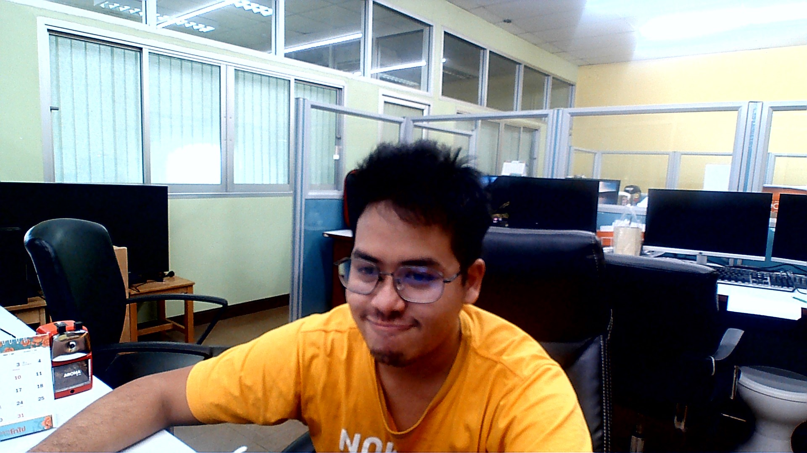

<h1 class="subtitle is-2 mb-0">Theethawat Savastham</h1>
<h1 class="subtitle is-3 pt-2">ธีร์ธวัช สวาสดิ์ธรรม</h1>

### Brief Info

- **Nickname:** Tin
- **Location:** From Yala => Songkhla Thailand
- **Birthday:** Febuary 7, 1998

### Position

- **2020-Present** Full Stack Software Developer at Intelligent Automation Research Center
- **2022-Present** Master Degree Student at Faculty of Engineering, Prince of Songkla University

### Education

- Bachelor in Engineering from Prince of Songkla University in 2021
- Grade 9 - 12 from Benjamarachutit School, Nakhon si thammarat
- Grade 7 - 8 from Mahavajiravudh School, Songkhla

 

  <a class="button is-link is-outlined mr-2" href="/file/Resume-20230412.pdf">Download Resume</a>
  <a class="button is-link is-outlined " href="/thai-biography">Thai Biography</a>

# About Myself

Hello, My name is Theethawat. Since I was in secondary school, I found that I fascinated in computer and I had the oppotunity to study in [Faculty of Engineering](https://www.eng.psu.ac.th) on [Computer Engineering Department](https://coe.psu.ac.th) since 2016. During 4.5 years of my study, computer was the place, I have created many of my idea and imagination beyond the word of impossible, until today the previous sentence still real.

After I graduated, I have joined [Intelligent Automation Research Center](https://iarc.psu.ac.th) that located in my faculty to work in title of **Full Stack Developer** unitl today. I usally create frontend web application with [React](https://reactjs.org) library on top of [Javascript](https://openjsf.org/) Language and for backend I use [Node.js](https://nodejs.org) with [Express.js](https://expressjs.com) as the main framework. On the database I am familar with NoSQL like [MongoDB](https://www.mongodb.com/home) more than relational database. Further more I must acting as the development operation, I always use [Docker](https://docker.com) as my main technique for our application deployment.

 

# My Working Project

### 2020

- Joing [Intelligent Automation Research Center](https://iarc.psu.ac.th) at Prince of Songkla University on July 2020, First Page of my working life as Software Developer
- Co-Developer of E-OnlineShop (Now [E-Merchant](https://emerchant.efactory.biz)) online your-own-business e-commerce platform, [E-Accom](https://eaccom.net) Accomodation management and [E-Salesman](https://esalesman.net) platform
- Co-Developer of E-IoTsoft or (Now [E-Machine](https://emachine.efactory.biz)), the IoT dashboard and controlling software, now it's handover to another developer to implement them.

### 2021

- Handover the E-Merchant and E-Machine to another developer in the center
- Co-Developer of E-Logistic (Now [E-Maintenance](https://emaintenance.efactory.biz)) that a cloud based ERP for southern logistic service prodiver (not success at all)
- Co-Developer of E-ERP (Now is [E-Manufac](https://emanufac.efactory.biz)) Cloud-based Manufacturing Mini ERP for SMEs local company
- Implement Version 2 of E-Accom and it always use on [Kittipoomhill](https://kittipoomhill.com) one of Nakhonsithammarat Province Resort until today, then scale af them to another hotels and resort.
- Co-Developer of **E-Worker** organization collaboration platform that always work at least 2 resort at Krabi most attractive place, Aonang.

### 2022

- Support and Maintenance **E-Manufac** and **E-Maintenance** follow the business enterprise requirement and make it can be more flexible and make a general platform and name all of these stack as [E-Factory](https://efactory.biz)
- Enroll as Master Degree student on [Computer Engineering](https://www.coe.psu.ac.th), Prince of Songkla University

 
 





 
<a href="/project/summary">
<button class="button is-link is-outlined">All Projects</button>
</a>

 

 

# My Academic Project

- Bachelor Degree Project - [E-Health for Personal Sensor Application](project/ehealth)
- Master Degree Thesis - Coming Soon

 

# My Programing

### Programing Language Skill

- JavaScript _Most Prefer_ (React, Node.js, MongoDB Aggregate)
- TypeScript
- Python
- Kotlin _(long time no see)_

### Interested

- Cloud Computing / Computing Infrastructure
- Web Application / Desktop Application
- Internet of Things

 

# Personal Life

- **Virtual Runner**, I had join in many virtual run event for my challenging.
- **Creating**, **Designing** and **Organizing**, as you can see in The Duck Creator Facebook.
- **Cat Lover**, I have 3 cats, Khaow tang, Khaow Neaw Ping and Khaow Lham. (Former I have their mom Steve and their father-in-law Pakdam)
- **Cooking** is the reason why my weight get more and more.
- **Culture**, **History** thinking.
- **Bloging** is why this page is avaliable to you. Visit My [Personal Bloging Article](/article/)
- **BNK48**, **CGM48** and AKB48 group is one of my motivation.

 

# My Article

- [Personal Bloging Article](/article/)
- [Technology or creativity](https://theduckcreator.in.th)
